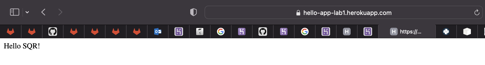

# Lab 1 -- Introduction to the quality gates

## Homework

I used [Heroku](https://heroku.com) to add autodeploy to the project.

**First of all, I used repository mirroring from GitLab to GitHub:**

1. Create a GitHub personal access token.
1. I the project, go to `Settings > Repository`, and then expand the `Mirroring repositories` section.
1. Enter a repository URL in format: `https://<your_github_username>@github.com/<your_github_repo_link>.git`
1. In the `Mirror direction` dropdown, select `Push`.
1. Select an `Password` method from the Authentication method dropdown.
1. Fill in `Password` field with your GitHub personal access token.
1. Select `Mirror repository` to save the configuration.
1. Check if the mirrored repository receives all changes via pushing to GitLab.

**Then I connected Heroku to GitHub.**

Use [this tutorial](https://www.google.com/search?client=safari&rls=en&sxsrf=AJOqlzVzEKeG5vmz_nJ8Np1p_MJisJqqYQ:1677064411496&q=how+to+auto+deploy+project+github+to+heroku&spell=1&sa=X&ved=2ahUKEwjkyozk_6j9AhWCxIsKHZ6xDKcQBSgAegQIFhAB&biw=1440&bih=820&dpr=2#kpvalbx=_3fj1Y6iUDY-UrwShgpfQBw_38).

**Finally, it's time for deploying a Python Application Using Heroku.**

Use [this tutorial](https://realpython.com/flask-by-example-part-1-project-setup/).

**Check.**

To check if server is running open this link: `https://hello-app-lab1.herokuapp.com`

